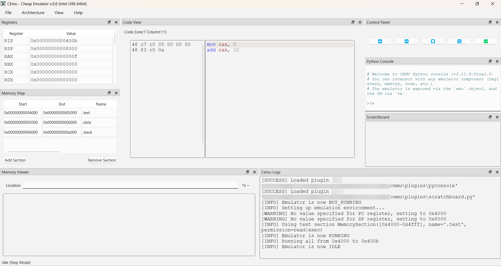
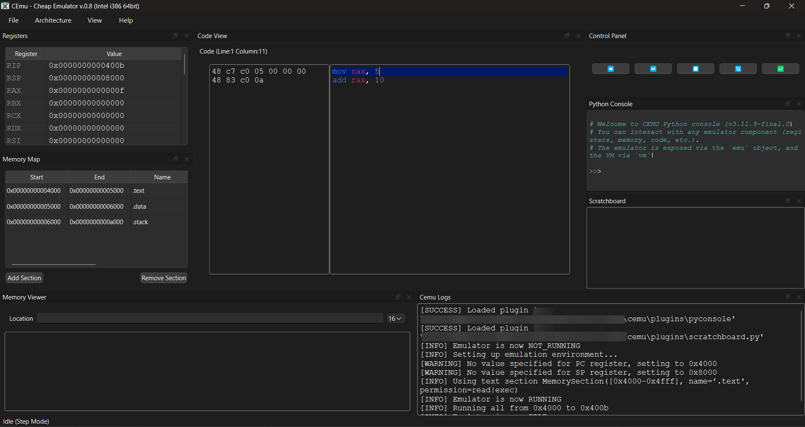

<p align="center">
  
</p>

<h2 align="center">CEmu : The Cheap (Assembly) Emulator</h2>

<p align="center">
  <a href="https://github.com/psf/black"></a>
  <a href="https://github.com/hugsy/cemu/blob/master/LICENSE"></a>
  
  <a href="https://pypi.org/project/cemu/"></a>
  <a href="https://discord.gg/qBn9MbG9vp"></a>
  <a href="https://pepy.tech/project/cemu"></a>
</p>


## Description

Writing assembly is fun. Assembly is the lowest language (humanly understandable) available to communicate with computers, and is crucial to understand the internal mechanisms of any machine. Unfortunately, setting up an environment to write, compile and run assembly for various architectures (x86, ARM, MIPS, SPARC) has always been painful. **CEmu** is an attempt to fix this by providing GUI, CLI and library that allows to write and test assembly quickly.

**CEmu** is built upon:
 * [Keystone](https://github.com/keystone-engine/keystone) for compiling assembly to bytecode
 * [Capstone](https://github.com/aquynh/capstone) for disassembling bytecode
 * [Unicorn](https://github.com/unicorn-engine/unicorn/) for the emulation

And the GUI is powered by in a Qt6.

It allows to test binary samples, check your shellcodes or even simply learn how to write assembly code, all of this for the following architectures:

  - x86-32 / x86-64
  - ARM / AArch64
  - MIPS / MIPS64
  - SPARC / SPARC64
  - PPC (but not emulation)

`CEmu` was mostly tested to work on Linux and Windows, but should work on MacOS.


## Installation ##

__Notes__

Since version 0.2.2, `cemu` is now Python3 only for simplicity and mostly also due to the fact that Python2 is not developed any longer. If your current installation of `cemu` is <= 0.2.1 and on Python2, please uninstall it and install it using Python3.

In addition, Python >= 3.10 is required, starting `0.6`.


### Quick install with PIP ###

Last stable from PyPI:

```bash
python3 -m pip install install cemu
```

Last stable from Github:

```bash
python3 -m pip install --user --upgrade git+https://github.com/hugsy/cemu.git@main#egg=cemu
```

For 99% of cases, that's all you need to do. `cemu` will be installed in the associated `Scripts` directory:
 * On Linux by default the executable will be found as `/usr/local/bin/cemu` if installed as root, `~/.local/bin/cemu` for non-root
 * On Windows, `%PYTHON_DIR%\Scripts\cemu.exe` if installed with privileges, `%APPDATA%\Python\Python310\Scripts\cemu.exe` if not

## Usage

### As a GUI

After installing with `pip`, simply run the executable, or invoke via Python

```bash
python3 -m cemu
```

This should produce a GUI similar to this:




### In the terminal

```bash
python -m cemu --cli
```

From where you'll end up in a REPL, allowing you to build and run the emulation environment.


### As a Library

```bash
python -i -c "import cemu"
```

Then use the provided API to build and run your environment.

## Contribution

`cemu` was created and maintained by myself, [`@_hugsy_`](https://twitter.com/_hugsy_), but kept fresh thanks to [all the contributors](https://github.com/hugsy/cemu/graphs/contributors).

[  ](https://github.com/hugsy/cemu/graphs/contributors)

To make contributions, the easiest way to get started is by using [`rye`](https://rye-up.sh) to get everything setup:

```bash
curl -sSf https://rye.astral.sh/get | bash  # opt
rye sync
```

Before submitting a Pull Request, ensure that both linting and formatting of your new code comply with the project's standards. This can be achieved easily as such:

```bash
rye lint
rye fmt
```

Note that any non-compliance will make CI validation fail, therefore preventing your code being merged.


But if you just like the tool as a user, consider dropping on Discord (or Twitter or other) a simple *"thanks"*, it is always very appreciated.
And if you can, consider [sponsoring me](https://github.com/hugsy/sponsors) - it really helps dedicating time and resources to the projects!
